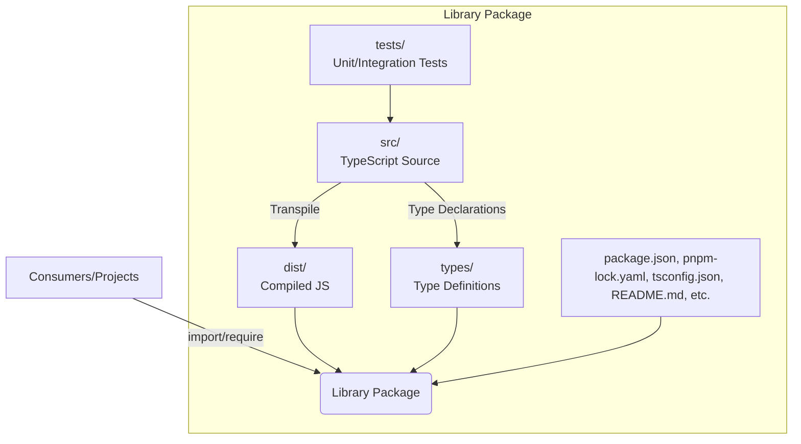

- **src/**: Main TypeScript source code.
- **tests/**: All test files (unit, integration).
- **dist/**: Output directory for compiled JavaScript.
- **types/**: Generated or manually written type definitions.
- **package.json**, **pnpm-lock.yaml**, **tsconfig.json**: Project configuration and dependency lock files.

**Build Flow:**  
Developers write code in `src/`, run tests in `tests/`, then transpile (compile) to `dist/` for publishing. Type definitions are generated to `types/` for consumers using TypeScript.

**Package Publishing:**  
Consumers/projects install the library from npm (using pnpm, npm, or yarn) and import/require it in their codebase.
